本文记录本科的毕业设计。实现了一个基于Android和FFMpeg的移动视频直播端。完成的主要工作有：
* 实现了基于Android的采集和编码，基于FFMpeg的混流和发送
* 利用Android NDK，完成Android平台上FFmpeg库的编译与移植
<!-- more -->

## 1. 相关平台和关键技术
### 1.1 Android系统架构
#### 1.1.1 系统层次
Android 系统是自由及开放源代码的操作系统，基于 Linux 内核开发完成，主要用于移动设备，如智能手机和平板电脑。Android 系统的层次图如图 2-1 所示，其软件层次结构自上而下分为5层。包括应用程序层、应用程序框架层、核心类库层、硬件抽象层和Linux底层。

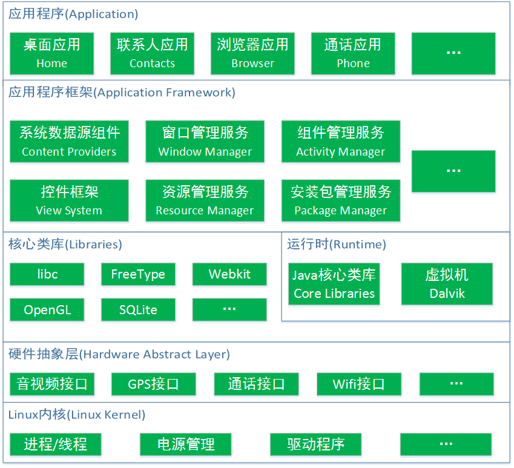

Android系统层次

应用程序和应用程序框架是 Java 语言开发的程序，核心类库是 C/C++语言开发的函数库，硬件抽象层和Linux内核是与硬件相关底层模块。由于Android系统是基于Linux改装而成，所以其具备 Linux的一些系统特性和功能。Android支持通过C语言访问系统底层的驱动和接口，这也为硬件编码提供了框架前提。Android SDK使用Java语言进行开发，使得应用程序的UI和空间是基于Java的，这保证了应用程序的跨平台特性。即一个应用程序可以在几乎所有相同版本的Android系统上运行。

#### 1.1.2 编程语言
Android的开发语言包括Java语言和C/C++语言。Java 语言开发的模块大多在系统上层，负责与用户进行直接的交互。C/C++的模块大多在系统底层，便于与底层Linux系统交互，提升运算性能。

Java是一种面向对象的程序设计语言，其编写的应用程序可以跨平台运行。Java吸取了C++语言面向对象的思想，抛弃了C++中容易引起错误或歧义的特性，成为了纯粹面向对象的编程语言。Java用引用取代C语言中的指针，用接口取代C语言的多重继承，增加了垃圾回收机制，可以自动释放不需要的变量。不过，由于Java程序运行在虚拟机上，不是直接在Linux系统上运行，这使得Java程序与C程序相比效率较低。

### 1.2 网络通信协议
本直播系统中Android手机通过无线网络传输视频信息，需要合适的网络通信协议来传送数据。流媒体强调低延时性，所以需要选择一个适合的传输协议进行传输。

为了在计算机网络中传输信息而约定的规则称为网络通信协议。网络通信协议分为七层，自下而上依次为:物理层、数据链路层、网络层、传输层、会话层、表示层和应用层。根据不同网络连接所面向服务类型的不同，可分为面相连接的服务和面向无连接的服务。根据通信系统的实际要求和物理连接，可以在协议栈的数据链路层或传输层实现这些方法。传输层中的UDP(用户数据报协议)是面向无连接的网络协议，TCP(传输控制协议)是面向连接的传输协议。

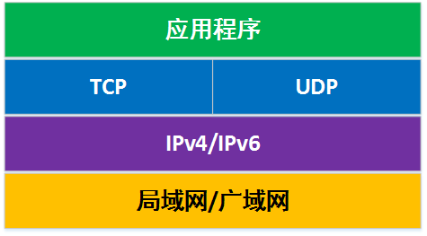

TCP/UPD网络架构示意图

#### 1.2.1 TCP(传输控制协议)
TCP协议是面向连接的传输协议。所谓面向连接，是基于电话系统模型的。是指在发送任何数据之前，要求先建立会话连接，然后才可以传输数据，传输完成后需要释放链接。这种传输方式一般被称为“可靠”的网络业务，它可以保证数据以与发送时相同的顺序到达，但会产生相对较多的网络开销，相应地也会增加延时。
#### 1.2.2 UDP(用户数据报协议)
UDP 协议是面向无连接的协议。所谓面向无连接，是基于邮政系统模型的。是指在发送方和接收方进行通信时不要求先建立会话连接。发送方只需简单地向接收方发送数据分组 (数据报)。这种业务与面向连接的业务相比可靠性低，无法防止报文的丢失、重复或失序，但是它通信比较迅速，网络开销比较小。

综上，TCP传输协议更加可靠，但会增加延时；UDP协议可靠性差，但通信建立过程简单，延时小。视频直播更强调实时性与低延时，对传输可靠性要求不高，如果由于网络问题出现丢包，在接收端体现为声音卡顿、画面花屏或有马赛克。对视频整体质量影响并不大。所以在本直播系统的网络通信使用UDP传输协议进行。

### 1.3 编码技术
#### 1.3.1 视频编码技术
视频编码是指通过特定的压缩编码算法，将一种格式的视频文件或流转换成另一种格式的过程。国际上比较重要的视频编码标准有 H.263、H.264、HEVC 等。此外还有各个企业开发的编码标准，如 Real-NetWorks公司的RealVideo、微软公司的 WMV、苹果公司的 QuickTime 等等。

手机摄像头采集到的是视频的原始格式，即YUV格式。YUV格式包含Y、U、V三个分量信号。Y表示灰度值，U、V是色差信号。虽然这种格式能保证最大程度的视频质量，但是却占据着很大的数据量。比如，将分辨率为320×240大小的YUV420格式视频通过网络上传，一帧数据大小可达上百KB。这将对系统性能和网络传输带来很大的负担。视频信息往往具有连续的影像，信息冗余性度高。所以，对原始视频数据进行压缩编码是很有必要的。

H.264 是一种用于视频的录制、压缩的编码标准和发布格式。H.264集中了以往编码标准的优点，作为一种面向块的基于运动补偿的编解码器标准，它使用了更佳精细的分像素运动矢量，环路滤波器也进行了改进，并创造了帧内预测和多参考帧等新技术。H.264的压缩性能得到了很大的提高，被广泛用于网络流媒体数据传输。H.264 与旧标准相比，它将占 用更少的带宽，只有MPEG-2，H.263的一半带宽或更少。H.264提高了对不同信道的适应能力，这有利于处理无码和丢包等错误的网络传输过程。H.264编码有广泛的应用范围，能够满足不同分辨率以及不同传输场合的需求。

#### 1.3.1 音频编码技术
直播系统内主要涉及两种音频编码方式，PCM编码和AAC编码。

PCM即Pulse Code Modulation的缩写，意为脉冲编码调制。PCM编码是数字通信的编码方式之一。PCM的主要过程包含取样、量化和编码，可以将连续的模拟信号用一串二进制码来表示。人耳听觉能够感受到的最高声音频率为20kHz。根据奈奎斯特采样定理，为了满足人耳的听觉需求，至少要使用40kHz的采样率。目前的CD音质音乐的采样率为44.1kHz，每个量化值对应一个16位的二进制码。故以CD音质对一个声道进行PCM编码的信号速率为16bits×44.1kHz=705.6kb/s。信号速率过大，需要进一步编码压缩。

AAC即Advanced Audio Coding的缩写，意为高级音频编码。AAC格式有较高的音频压缩比，通常为18:1，AAC采用的描述方式复杂性低，而且支持多声道，与传统编码方式相比，其在同规格的情况下有更好的音质。AAC可以支持多达 48个音轨，15个低频音轨，5.1 多声道支持，更高的采样率(最高可达 96kHz)和更高的采样精度(最高达 32bit)。

### 1.4 FFmpeg编解码工具
FFmpeg是一个自由软件，可以执行音视频多种格式的编码、转码、串流功能。FFmpeg采用C语言编写，基于Linux操作系统完成，是一套完整的免费、开源、跨平台的音视频解决方案。FFmpeg项目名称来源于Mpeg视频编码标准，“FF”代表Fast Forward。

FFmpeg项目包含以下模块组成:
* ffmplay: 支持对视频文件转换格式和电视卡的实时编码的命令行工具
* ffserver: 一个HTTP多媒体广播串流服务器
* ffplay:基于SDL(另一套开源跨平台多媒体开发库)与FFmpeg函数库实现的简单播放器
* libavcodec: 包含全部FFmpeg音频、视频编解码函数库
* libavformat: 包含复用器和去复用器函数库
* libavutil: 包含一些工具函数库
* libpostproc: 对于视频做前期处理的函数库
* libswscale: 对于影像做缩放的函数库

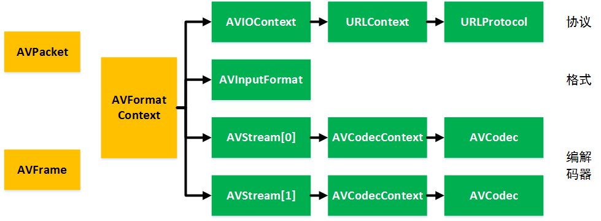

主要结构体之间的对应关系

### 1.5 JNI
Android系统采用Java语言开发，而调用FFmpeg的程序模块需要用C语言编写，若想在Android手机上实现FFmpeg的功能，需要解决的问题是如何实现Java语言和C/C++语言的通信。JNI技术和Android NDK可以解决这个问题。

JNI是Java Native Interface的缩写，中文名是Java本地接口。它提供了若干API实现了Java和其他语言(主要是C/C++)的通信。Java对其他语言的调用是用动态链接库实现的。动态链接库在Windows系统上的扩展名是DLL，在 Linux系统上是SO。通过把C/C++语言编写的模块编译成扩展名为SO的动态链接库，再通过Java本地方法调用库中的相关函数，即可实现两种语言的互通。

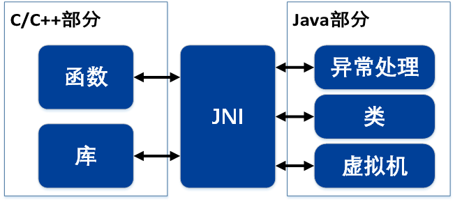

JNI

JNI技术作为Java的一个标准，主要目的是:
* 应用程序需要调用系统相关的功能，然而Java不支持或难以实现
* 一些功能模块已经用其他语言编写好，用Java编程时可以重复使用
* 为了提高性能，需要使用汇编语言或C/C++来实现一些功能

## 2. 系统设计
### 2.1 直播应用系统设计
使用Android API编码和FFmpeg实现。

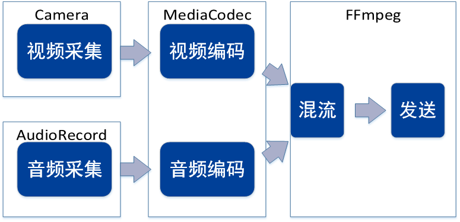

使用 Android API编码和FFmpeg实现的直播架构

此架构的采集和编码均用Android API实现，混流和发送通过FFmpeg实现。MediaCodec是Android的编解码器类，可以结合手机硬件特点，调用硬件加速功能。

从编码格式方面，视频流采集YUV数据，编码成H.264裸流，音频采集PCM格式音源，压缩编码成AAC格式。之后用FFmpeg混流成ts格式的数据包，通过udp协议进行发送。

### 2.2 多线程与数据通道
本系统中各模块相互独立，并行处理。为此需要实现多线程。Android系统基于Java开发，所以也有主线程和子线程之区别。主线程用于实现业务逻辑、UI绘制更新、各种子线程串联;子线程用于完成耗时任务，如联网通信、读写 SD卡、后台长时间运行等。

Android中构造新线程可以继承Thread类，或实现Runnable接口。Thread类是线程类，其中两个最重要的方法是start()方法和run()方法。前者用于启动线程，包含线程启动后程序执行的代码。Runnable是一个接口，只有run()方法，此接口本身并没有任何对线程的支持，可以通过Thread类对其进行控制。Thread类当中有一个构造方法public Thread(Runnable target)，也就是说可以通过Thread类启动Runnable实现的多线程。

本系统中，将采用“多线程+全局变量”的形式实现各模块的并行处理。各个模块在不同的线程中独立运行，中间的数据通道通过公有静态变量实现。应用中将有五个线程，一个是主线程，其余线程分别控制音频采集、视频编码、音频编码和混流传输。主线程实现Camera回调接口并控制UI更新;音频采集、视频编码、音频编码均继承Thread类;混流传输通过实现Runnable接口来实现。

在各模块的衔接上，通常使用Buffer或队列作为数据通道，实现数据传递与前后同步。本系统中，在音视频的采集到编码处各需一个数据通道;在编码输出后进行混流之前各需一个数据通道。前两个在Java层实现，后两个在JNI层中实现。

Java中的数据通道用阻塞队列实现。阻塞队列(BlockingQueue)是一个支持两个附加操作的队列。这两个附加的操作是:在队列为空时，获取元素的线程会等待队列变为非空。当队列满时，存储元素的线程会等待队列可用。阻塞队列常用于生产者和消费者的场景，生产者是往队列里添加元素的线程，消费者是从队列里拿元素的线程。

JNI层中的数据通道用C++语言标准库(STL)中的queue实现。queue队列是无界队列，对前后线程没有控制。需要在出队处理时人为控制等待时间，实现前后同步。

### 2.3 编码模块
音视频的编解码通过Android的MediaCodec类完成。根据Android开发文档，MediaCodec类可调用底层资源完成媒体编解码。MediaCodec即可以执行编码任务，也可以执行解码任务。每个实例化的Codec都有一些输入缓存和输出缓存，当输入端有待编码数据要传入时，可通过queueInputBuffer(int, int, int, long, int)方法将数据推入输入缓存当中。Codec完成编码后，将通过dequeueOutputBuffer(MediaCodec.BufferInfo, long)方法将编码后数据推入输出缓存。接收端从输出缓冲中读出数据后，该缓存需要通过 releaseOutputBuffer(int, boolean)方法进行释放。

MediaCodec示意图

### 2.3 JNI调用
Android API使用Java语言开发，FFmpeg使用 C/C++开发。为实现Android对FFmpeg模块的调用，需要JNI调用技术来实现。

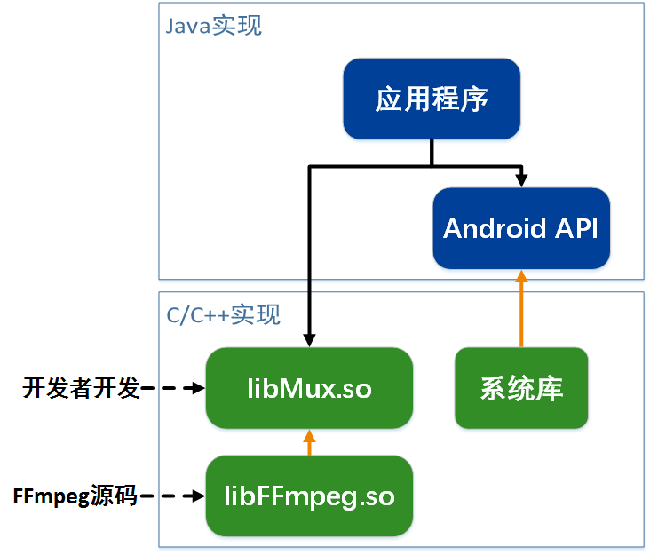

JNI 调用结构图

由于Android系统基于Linux开发，所以系统底层均使用C/C++实现。Android 应用程序运行在Java虚拟机上。所以当应用通过Android API与系统底层进行交互时，API函数首先访问C/C++实现的系统库，根据库中的一些函数执行相关功能。与此架构类似，本系统将FFmpeg源码和混流传输模块的C/C++代码编译成动态链接库，通过应用程序通过 JNI 接口函数来调用这些底层库函数，实现两种语言交互的特点。

## 3. 系统实现
### 3.1 系统总体层次
本系统中，将采用“多线程+全局变量”的形式实现各模块的并行处理。各个模块在不同的线程中各自运行。在Java层面，系统实现了7个类，名称和功能如下:
* MainActivity类:程序主进程和入口点，负责UI控制、摄像头控制和视频采集
* AacRecord类:获取麦克风控制权，以开启子进程的方式实现音频采集
* AvcEncoder类:实例化MediaCodec编码器，以开启子进程的方式实现视频编码
* AacEncoder类:实例化MediaCodec编码器，以开启子进程的方式实现音频编码
* JNI类:对本地函数进行声明，通过此类的方法可以调用 FFmpeg 相关函数模块
* av_Queue类:实例化一个静态、公有的JNI实例。全局通过此实例来调用JNI函数
* MuxAndStream类:实现了Runnable接口，作为子进程调用JNI当中封装与发送模块

在Java层中，程序将实现两个定长的阻塞队列，作为公有的静态全局变量，作为音视频采集到传输的数据通道。阻塞队列为Java本身自有的数据结构，这里使用ArrayBlockingQueue来实现。ArrayBlockingQueue是基于数组实现的固定长度阻塞队列。在JNI层中，程序将通过C语言标准库实现两个queue队列，作为音视频编码后结果进行混流的数据通道。

MediaCodec示意图

程序从上之下分为Android API、JNI和FFmpeg三个部分。Android API层实现采集和编码，使用Java语言实现;Fmpeg层实现混流和发送，使用C/C++实现;JNI层用于实现移动终端直播编转码技术研究顶层对底层的调用和不同语言间的通信。

### 3.2 Android API层
#### 3.2.1 采集模块
##### 3.2.1.1 视频采集
本直播系统的视频源来自Android手机摄像头，通过Android系统当中的Camera类实现对硬件摄像头的控制，可以设定采集帧率、采集画面大小等参数，并把采集到的每一帧数据传递给编码模块。TextureView组件可以实现对摄像头画面的实时预览。

在Android摄像头开发中，一般需要一个显示面来显示当前摄像头采集到的画面。Android中常见的显示面有Surface、SurfaceTexture、SurfaceView、TextureView等等。Surface对应了一块屏幕缓冲区，是Android 系统中用来画图形和图像的地方; SurfaceTexture也用于显示图像信息，但与Surface不同的是，SurfaceTexture的图像并不直接显示，而是转为GL外部纹理，因此可用于图像流数据的二次处理(滤镜、特效等);SurfaceView派生自View类，但其内部自嵌了一个Surface，SurfaceView比Surface更加灵活，可以控制其内嵌Surface显示的格式和尺寸，也可以通过SurfaceView控制Surface的绘制位置;TextureView派生自View类，可以将内容流直接投影到View中，其内部集成了一个SurfaceTexture，与SurfaceView不同的是，TextureView可以和其他普通的View一样进行移动、旋转、缩放等变化，使用更加灵活。在视频采集模块当中使用TextureView实现摄像头实时预览。综上分析，为增强灵活性和程序后续的扩展性，采集模块的实时显示位置使用TextureView实现。

Camera类是Android系统中用于控制摄像头的API，通过设置参数，可以控制摄像头完成采集、拍照、预览等操作。为了控制摄像头进行数据采集，首先，需要实例化一个Camera类的对象。调用open()方法打开摄像头。然后设置摄像头参数，包括帧率、画面大小、码率。接着设置预览控件，即把摄像头与TextureView绑定起来，使得摄像头的影像实时显示在TextureView当中。

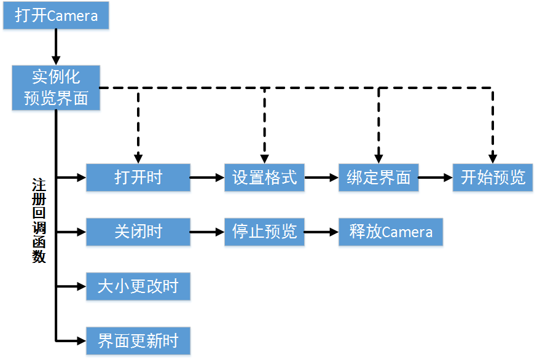

视频采集模块逻辑框图

为了获取采集到的每一帧信息，需要注册回调函数，使该函数在每次Camera预览帧可用时执行，并返回采集到的数据。采集到的YUV格式数据将通过数据通道传递给后续的编码模块。

##### 3.2.1.2 音频采集
直播系统的音频源来自Android手机的麦克风，通过Android系统当中的AudioRecord类可以实现对音源硬件的控制，此类可以接管的音频源包括手机麦克风、通话话筒、单侧麦克风等。

录音时，原始音频数据将存储在实例化后的AudioRecord对象的缓存当中，这个缓存的大小与采样频率、声道、编码方式有关。所以如果缓存过小，将导致缓存溢出，录音失败。这个缓存的大小需要在对象实例化时自行设置，所以在开始录音之前，需要根据录音的格式确定此数据缓存的最小容量。此最小容量通过AudioRecord类的getMinBufferSize 方法来获得。通过传入采样率、声道数量和编码格式作为参数可以返回一个最小的Buffer容量。然后才可以构造一个AndioRecord对象。为保证缓存不溢出，构造时输入的缓存大小必须 比最小容量大。如果此容量小于最小缓存容量，将导致对象实例化失败。

#### 3.2.2 编码模块
编码模块中的编码器通过MediaCodec类实现。输入和输出数据通过MediaCodec自身的缓存完成数据传递。在编码器输出时，首先会输出一个标志位，用于指示当前输出缓存的数据类型，包括配置信息、关键帧、结束位。配置信息不含音视频数据，只包含媒体的一些元数据比如编码格式、时间戳等信息。关键帧常用于编码视频时，表示当前输出缓存为I帧。结束位用于输出到文件系统时的数据回写，在直播中不需要。

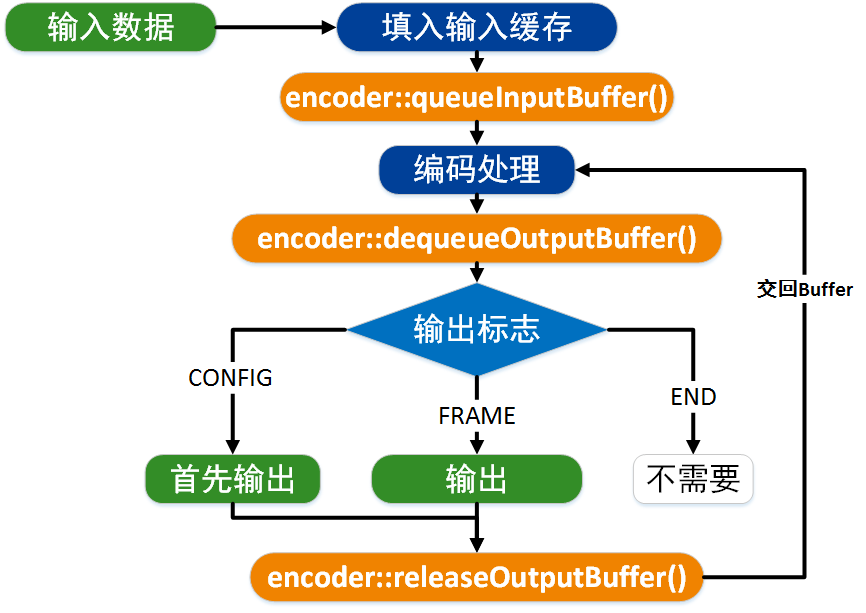

编码器运行结构

##### 3.2.2.1 音频编码
音频采集模块输出的音频原始格式为PCM格式，音频编码器将对其压缩成AAC格式。在编码开始前，需要设置编码格式、采样率、比特率和帧率。其中编码格式为“audio/mp4a-latm”，采样率和比特率与音频采集模块一致。

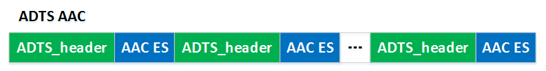

ADTS 音频格式图

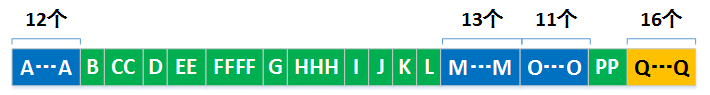

ADTS Header位

输入数据为音频编码模块采集到的数据，通过阻塞队列传入。经过MediaCodec编码器编码后得到AAC格式的ES裸流。这种裸流只包含音频数据，不包含采样率、编码格式等配置信息，所以无法播放，保存成本地文件也无法打开。为此，需要把此AAC码流封装成ADTS流。ADTS流全称为(Audio Data Transport Stream)，是AAC流的一种传输格式，体现为在AAC的ES流的每帧之前添加7个字节的Header。ADTS头中包含此音频的采样率、声道数和帧长度等信息。

| 字母        | 位长度    |  描述  |  值  |
| :--------: | :-----:  | :----: |  :----: |
| A        | 12      |   同步位，必须为 0xFFF    | 1111 1111 1111 |
| B        | 1      |   MPEG版本    | 1为Mpeg-2 |
| C        | 2      |   层    |  00 |
| D        | 1      |   CRC校验，0为关闭校验    | 0 |
| E        | 2      |   MPEG 音频对象索引为 2    | 01 |
| F        | 4      |   采样频率 44100Hz 对应 0100 | 0100 |
| G        | 1      |   编码时设为0，解码时任意    | 0 | 
| H        | 3      |   设置音频声道，001 表示单声道 | 001 |
| I        | 1      |   编码时设为0，解码时任意    | 0 |
| J        | 1      |   编码时设为0，解码时任意    | 0 |
| K        | 1      |   编码时设为0，解码时任意    | 0 |
| L        | 1      |   编码时设为0，解码时任意    | 0 |
| M        | 13      |   帧长度    | 具体设置 |
| O        | 11      |   表示可变比特率    | 111 1111 1111 |
| P        | 2      |   每帧包含AAC帧的数目再减1 | 00 |
| Q        | 16      |   CRC校验位    | 无 |

##### 3.2.2.2 视频编码
视频采集模块输出的视频原始数据为NV21的YUV格式，视频编码器将对其压缩成H.264格式。在编码开始前，需要输入视频的比特率、帧率、画面长宽和关键帧间隔作为参数。其中编码格式为“video/avc”。

手机采集的视频格式和编码器输入格式均为YUV420格式。但YUV420有不同的子格式。NV12和NV21都是属于YUV420的格式。每个手机支持的编码输入格式会有些区别，为保证兼容性，这里使用NV12格式作为编码器输入。而视频采集模块输出的视频格式为NV21，所以需要将NV21格式转换为NV12格式。
H.264编码标准包含 I 帧、P 帧与 B 帧。其中 I 帧是关键帧，保存了当前图像的所有信息，可以独立地被解码。P 帧以它前面的 I 帧或 P 帧作为参考，保存了当前帧与前向预测帧的差值。B 帧以它前后各一帧作为参考，保存了当前图像相对参考帧的差值，比 P 帧更 节省空间。对编码器可以设置 I 帧间隔，若间隔过小，将减小压缩效率，增大图像稳定 性。若间隔过大，将增加压缩效率，减小稳定性。经过实验发现，MediaCodec 编码的 H.264 视频流只包含 I 帧和 P 帧，不含 B 帧。MediaCodec 的输出缓存的标志位可以用来判定输出帧的类型，可分为配置帧、关键帧、和其他帧。配置帧不是真正的视频帧，它只是包含视频基本信息的一个数据包，将其放置于视频序列之首或关键帧之首可以便于解码器解码。关键帧即 I 帧。其他帧即 P 帧。

此外，由于手机型号限制，视频采集模块输出格式为YUV420-NV21，而编码器接受的类型是YUV420-NV12。所以在视频编码器输入端，需要进行一次格式转换。

NV21和NV12属于YUV420sp格式，是一种two-plane模式，即Y和UV分为两个Plane，但是UV(CbCr)为交错存储，而不是分为三个plane。

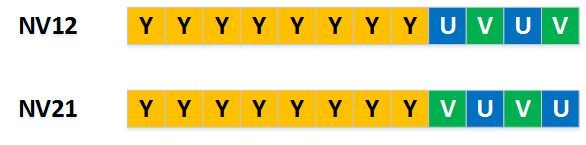

NV21 格式与 NV12 格式

所以，将NV21转换为NV12格式，只需要按位将前面Y部分直接复制下来，后面 VU 分量进行错位复制，此处用三个 for 循环实现。

#### 3.2.3 JNI 层
JNI 层是本系统当中的重要环节，起到在Java和C/C++中进行通信的作用，包含JNI接口函数和中间变量两部分，用于传输Java层中编码完成的数据，并可以对C/C++层起到一定的控制作用。

JNI接口函数在Java层中进行声明，在C/C++层中进行实现。本系统中的“入队”函数即是一JNI 接口函数。此函数实现了将Java层的数据入队到C/C++层中的一个队列中。此过程完成了跨语言调用和数据类型的转换。

编码数据从Java层传入到C/C++层，必须要经过JNI。而且由于两种语言不同，其对应的数据类型也要发生变化。MediaCodec编码完的数据都以字节数组(byte[])的格式进行储存，FFmpeg中音视频信息要以无符号8位整型数组来表示(uint8_t[size])，中间格式转换使用JNI来完成。

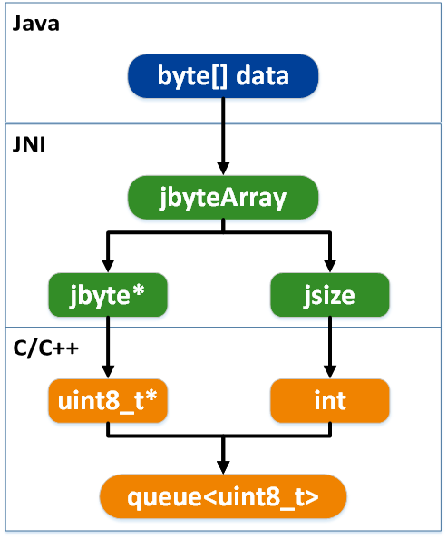

JNI 转换数据类型过程

在JNI层，JNI运行环境会首先将字节数组以jbyteArray的形式进行储存，并可以转化成一个jbyte指针和一个jsize类型。jbyte指针指向此数组的内存空间，jsize表示此段内存空间的大小。jbyte类型可以强制转换为uint8_t类型，jsize也可以强制转换成int类型。至此，一个Java层的字节数组转化成了C/C++层中指向此段内存首地址的指针和表示此内存空间长度的整数。

为传递数据，在C/C++层定义一个C++标准库当中的queue实例，元素类型为uint8_t。当有数据传入时，把指针指向的内存空间所有数据都进行入队操作，等待之后FFmpeg的处理。

JNI 层的数据传递原理

#### 3.2.4 FFmpeg 层
##### 3.2.4.1 FFmpeg 的编译与移植
在调用FFmpeg相关组件之前，需要先将FFmpeg移植到Android应用当中。FFmpeg函数库是一套以C语言编写的函数库，基于Linux系统开发，所以编译需要在Linux环境下进行，可以用Linux虚拟机或Cygwin来实现。FFmpeg代码包中的configure文件保存了FFmpeg的编译选项与控制指令。若按照默认设置进行编译，得到的动态库文件名类似“libavcodec.so.55.39.101”，即版本号在文件后缀的后侧，将导致Android系统上无法加载。所以需要修改配置文件，再用make和make install命令进行编译。完成编译后，将动态库文件拷贝到Android项目中的jni文件夹，并编写Android.mk文件，把所有动态库打包进Android安装文件中。

##### 3.2.4.2 FFmpeg 的工作模式
FFmpeg作为音视频处理工具，一般是面向文件进行工作，尤其是在输入端。这种模式是FFmpeg最常见的工作模式，配置较为简单。只需要定义文件路径并用avformat_open_input()函数打开，即可按文件路径把文件进行解析，绑定给AVFormatContext实体并开始读取。

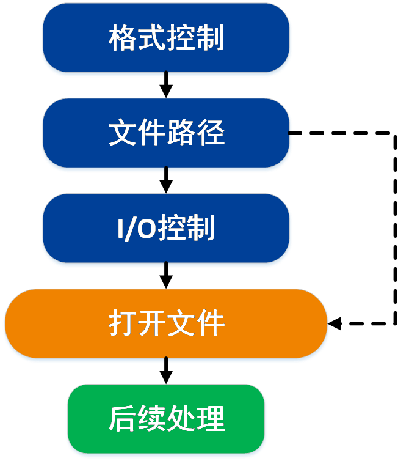

FFmpeg 面向文件的工作模式

然而，本直播系统是面向实时流处理的，不存在文件路径。所以不能用面向文件的工作模式，而应该是面向内存的工作模式。

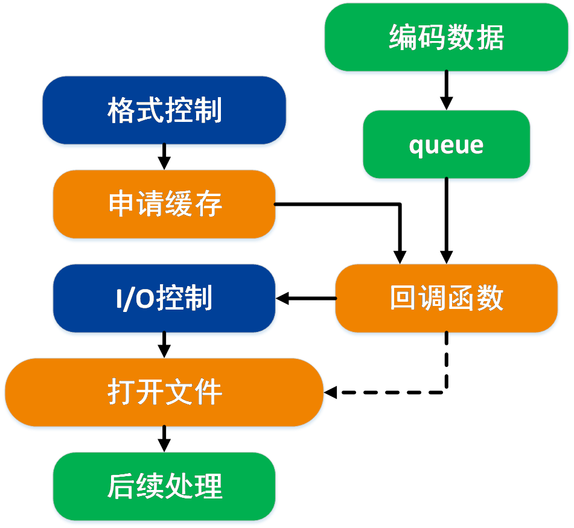

FFmpeg 面向内存的工作模式

由于不从文件中获取信息，所以此模式需要定义缓存并注册回调函数。回调函数的原型是int read_buffer(void *opaque, uint8_t *buf, int buf_size)。第一个参数opaque一般情况下不使用，*buf和buf_size分别表示缓存地址和缓存长度。每当程序需要读取数据时将执行回调函数，回调函数将从队列中取出buf_size长度的元素，并把此内存空间的数据赋值给buf指针所指向的内存空间。此时文件路径将被忽略，程序将从回调函数中获取数据。

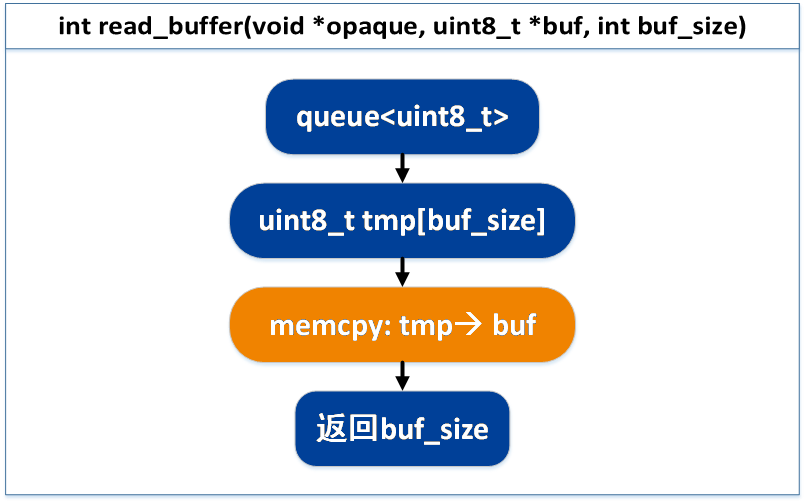

FFmpeg 回调函数

##### 3.2.4.3 混流与发送模块流程设计
经过之前的数据处理，从音频编码器输出加装了ADTS头的AAC音频流，从视频编码器输出H.264裸流，为便于音视频传输，下面将两路流混流成TS格式。

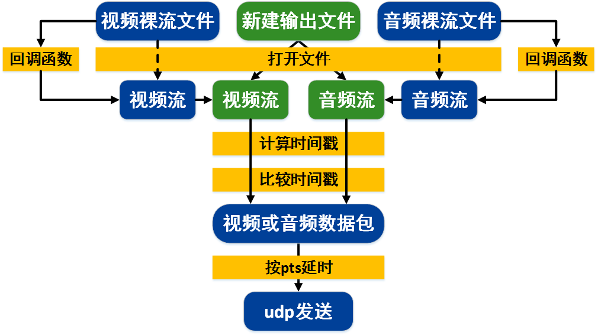

音视频混流过程图

混流模块的输入数据为Android应用层编码器输出的音视频裸流，传入方式从回调函数中获得。新建输出文件，文件路径为udp协议的目标ip地址和端口号。设置新建文件格式为mpegts，并内建两路流，分别将输入的音视频流复制进来。然后，通过计算时间戳、比较时间戳和延时发送等操作，完成混流与发送功能，下面具体叙述。

* 时间戳与时间基

视频当中的时间戳分为显示时间戳(pts)和解码时间戳(dts)。每一帧中都会包含这两种时间戳。pts用于指示播放器在何时显示该帧，dts表示解码器何时解码该帧。 MediaCodec 类编码的H.264视频不包含B帧。在不含B帧的情况下，可以认为pts等于dts。时间戳有其独有的时间单位，即时间基(time base)。不同的格式有不同的时间基。 在FFmpeg中，H.264的时间基是1/1200000 秒，mpegts的时间基是1/90000秒，FFmpeg程序内部的计时单位是1毫秒。

* 计算时间戳

计算时间戳主要用于视频流，因为H.264裸流不携带时间戳信息，所以解码播放时不能确定某一帧在何时进行显示。AAC流由于在Java层添加了ADTS header，所以会携带一些媒体信息。在计算时间戳时，通常使用帧率去估算。根据每一帧的持续时间，除以时间基，可得每一帧相差的时间戳长度。

$$
duration=\frac{1}{frame\_rate} \div TIME\_BASE
$$

所以，当前一帧的pts可以通过当前帧数目与时间戳长度相乘得到。

$$
pts=duration \times frame\_index
$$

* 时间基的转换
由于输入和输出格式不同，所以要对时间戳的单位进行转换。时间戳乘以对应的时间基，结果是以秒为单位的时间。

$$
pts\_new=pts\_old\times\frac{TIME\_BASE\_OLD}{TIME\_BASE\_NEW}
$$

* 降低延时
FFmpeg 混流发送模块初始化时要读取较多数据用于分析格式等初始化等操作。这将导 致较大延时，下面具体说明。

FFmpeg 工作流程(未开始混流)

此时 FFmpeg 混流模块还未开始工作，编码器编码数据全部在队列里。

FFmpeg 工作流程(初始化)

当 FFmpeg 混流模块开始工作时，首先要进行初始化相关操作，所以会在很短时间内从队列中读取很多数据。

FFmpeg 工作流程(队头部分元素舍弃)

当初始化结束后，FFmpeg 将向外发送ts数据包，但它要先发送初始化时读入的数据。由于初始化时读入数据较多，此时FFmpeg模块不需要从队列内拿取数据，然而编码模块仍在向队列内输入数据。这将导致队列长度变长，前后整体延时偏大。

为降低延时，这里将舍弃一部分队列数据。将队首部分较多积累的元素舍弃，以达到减少延时的目的。

FFmpeg 工作流程(进入稳定状态)

当FFmpeg模块将初始化时读入的大部分数据发送出去后，它将需要从队列中读取数据。由于队列中队首部分元素被舍弃，延时将降低。FFmepg初始化工作完成，内部数据长度保持相对稳定。这种方法体现为直播开始的几秒钟视频将向前突跳几秒，之后一直保持稳定，此突跳减小了延时。

## 4. 系统测试
系统测试分三个部分进行。分别是编码测试、音视频流测试和直播测试。
### 4.1 编码测试
编码测试通过把音视频流以文件的形式写入手机SD卡内，然后通过一些软件对其进行解析。

编码测试原理图

#### 4.1.1 H.264文件分析
将 Android 编码的 H.264 裸流以文件形式保存到手机 SD 卡内。

| 参数        | 设置    |
| :--------: | :-----:  |
| 画面长宽        | 640x480      |
| 编码帧率        | 30fps      |
| 采集帧率        | 30fps      |
| 码率        | 1M      |
| I帧间隔        |  5秒     |

用Eyecard StreamEye分析器查看

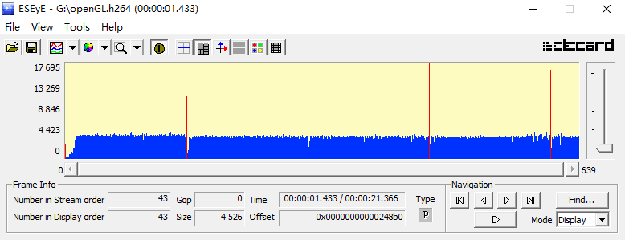

H.264 文件分析序列

柱状图中蓝色表示 P 帧，红色表示 I 帧，序列中 没有 B 帧。横轴表示时间，纵轴表示该帧大小。I 帧约每 5 秒出现一次，与设置参数吻合。

#### 4.1.2 AAC文件分析

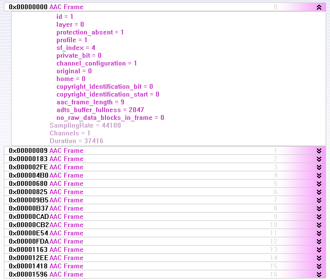

AAC文件分析结果

从解析结果来看 AAC 帧内包含了采样率、 声道设置和持续时间等信息。

#### 4.1.3 ts文件分析
在C语言层中，修改FFmpeg模块，把向UDP地址发送的ts包以文件形式保存在手机SD卡内。用TS文件分析工具打开。

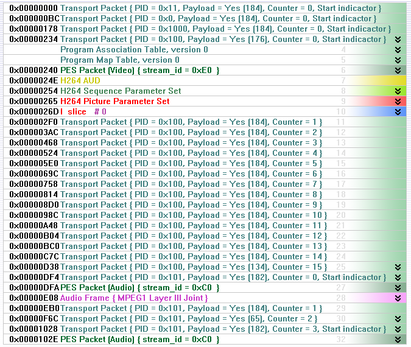

TS文件分析序列

### 4.2 音视频流测试
音视频流测试对JNI层中的队列数据进行动态分析。首先开启采集编码，等JNI层队列填充到一定长度后开始混流发送。主要考察推入队列中数据的大小和数据长度。
#### 4.2.1 编码帧大小变化分析

* 音频帧大小变化分析

横轴表示当前音频帧序号，纵轴表示当前音频帧的大小。音频包大小变化不大，基本稳定在 375 字节左右。

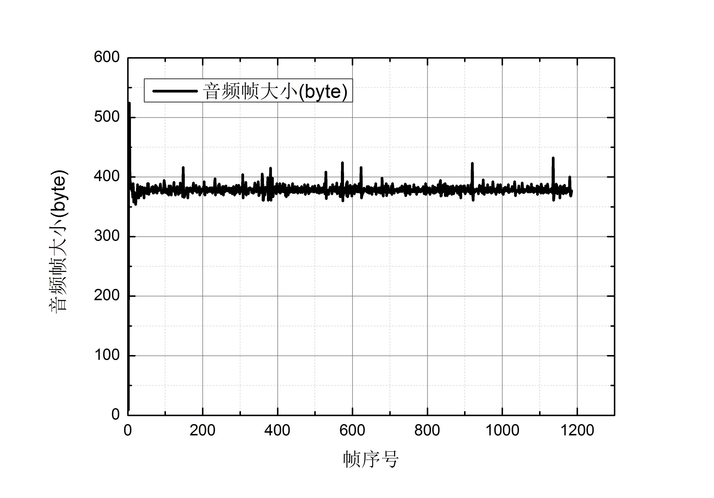

每个音频帧大小的变化趋势图

* 视频帧大小变化分析

横轴表示视频帧序号，纵轴表示编码每一帧视频的大小。

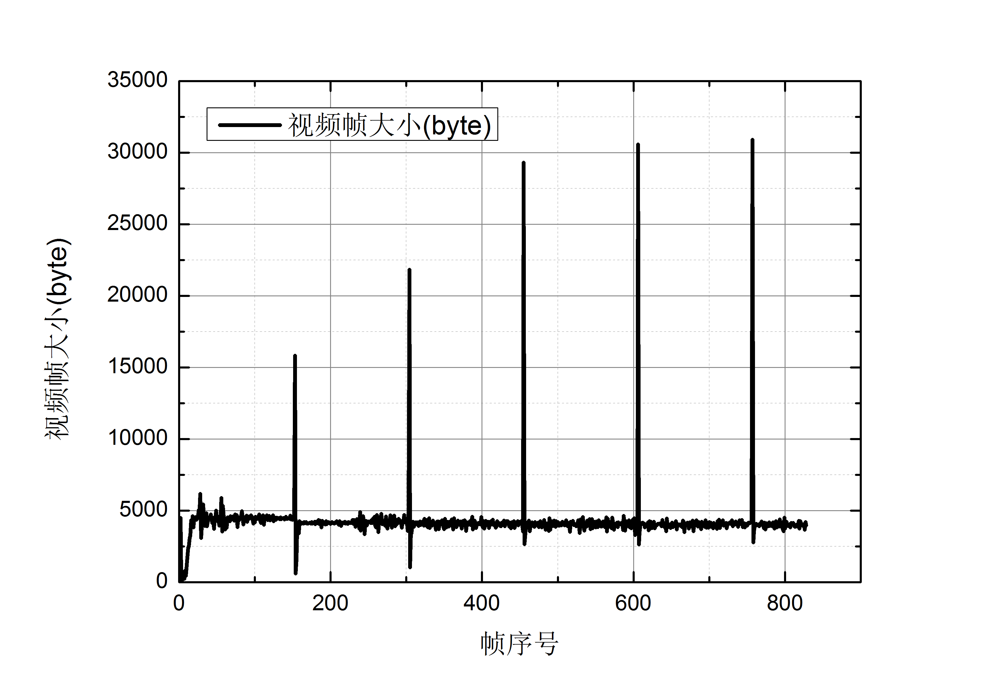

视频帧大小变化曲线图

视频帧大小变化有明显的突跳过程，这些比较大的视频帧即I帧，其他比较小的视频帧是P帧，这个结果与前述分析结果吻合。

#### 4.2.2 队列长度变化
Java层编码模块和FFmpeg混流模块的数据传递是通过一个C++标准库的queue实现的。本部分分析此队列在混流开始前后长度的变化情况。由于队列内元素为无符号8位整型，占用空间为1字节，所以队列长度(元素个数)与队列大小相同。

* 音频队列长度变化

横轴表示音频帧序号，纵轴表示音频队列总长度。

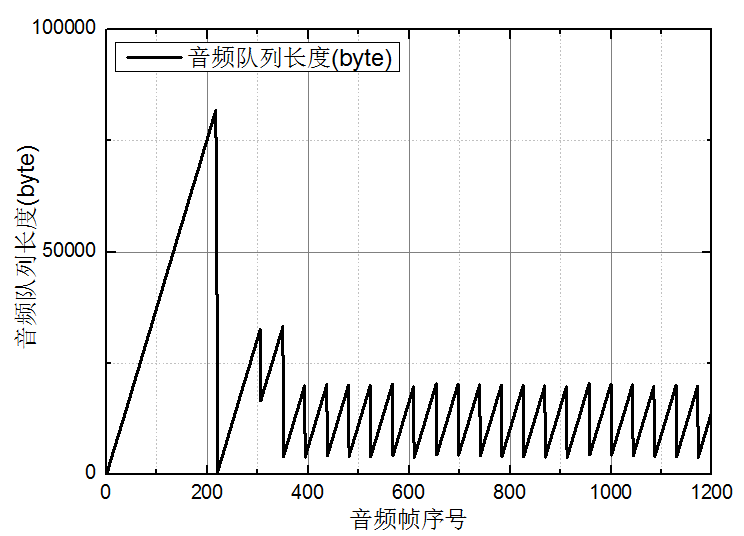

音频队列长度变化图

首先在 FFmpeg 混流发送模块未开启前，队列长度一直在增长。当FFmpeg 模块开始初始化时，队列元素急剧减少。之后，因为 FFmpeg 在处理或发送初始化 时读入的数据，还不需要从队列当中读入数据，所以队列长度发生小幅提升。接下来的一个锯齿形表示FFmpeg完成初始化，从队列中读取数据进行处理。由于FFmpeg模块初始化结束，所以舍弃队首部分的元素，体现为接着的一段下降端。之后，队列元素将稳定在一个区间内进行浮动

* 视频队列长度变化

横轴表示视频帧序号，纵轴表示视频队列的总长度。

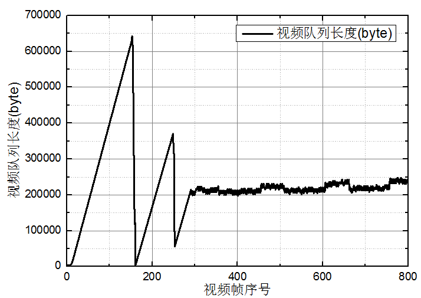

视频队列长度变化图

在 Fmpeg模块还未开始工作时，视频队列长度一直在增长。当FFmpeg进行初始化时，队列内元素急剧减少。随后队列长度的上升表示FFmpeg在处理初始化时读入的数据，不需要从队列内读入数据。当初始化结束后，视频队列队首元素将被舍弃，所以队列长度下降。由于通过比较时间戳，首先发送的数据包是音频数据，所以第二个峰出没有锯齿形状。随后视频队列先稳定上升一段时间后达到稳定状态。稳定上升的部分表示此时发送的数据都是音频数据，所以没用从视频队列内读取数据。

### 4.3 直播测试

输入栏分别输入接收端的 IP 地址和端口号。下面有两个按钮，Start recording按钮按下后将完成音视频的采集和编码，并把编码后的数据通过JNI层传递到FFmpeg中的队列中。Start Stream 按钮用于开启 FFmpeg的混流和发送模块，按下后，FFmpeg将从队列中读取数据，进行混流和发送。

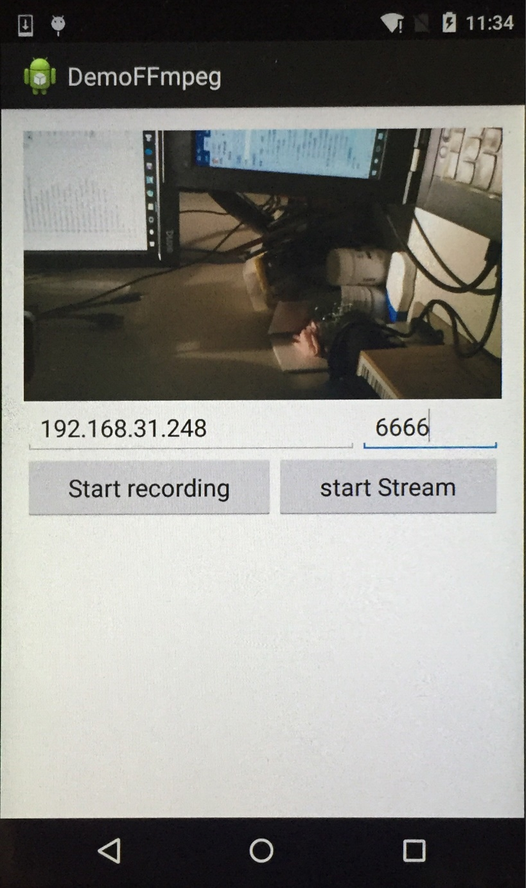

直播 App 界面

实际直播画面如图所示，图中手机对着电脑屏幕上的时钟进行拍摄，最上方的画面是VLC播放器，播放地址为udp://@:6666。发送端是手机，接收端是电脑上的 VLC。接收端和发送端通过连接一个Wifi热点完成通信。直播刚刚开始时，FFmpeg模块发送的数据是初始化时一次读入的，没有继续从队列中读取数据，所以延时较大，约6秒。

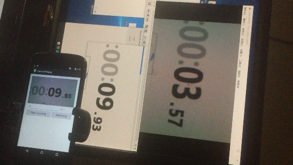

直播实际画面(舍弃队列元素前)

直播实际画面(舍弃队列元素后)

当FFmpeg模块初始化完成后，队列中队首部分元素将被舍弃，接收端视频将向前突跳约3秒，延时降低至3秒。画面清晰，几乎没有卡顿。